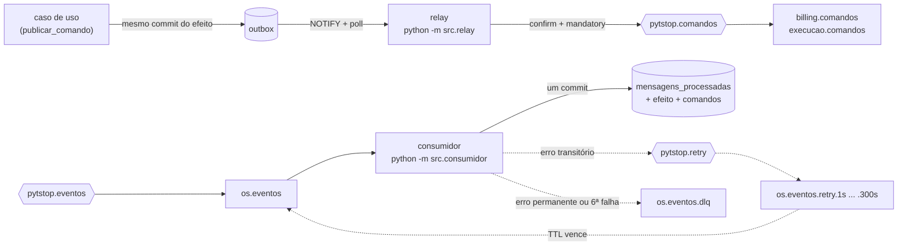
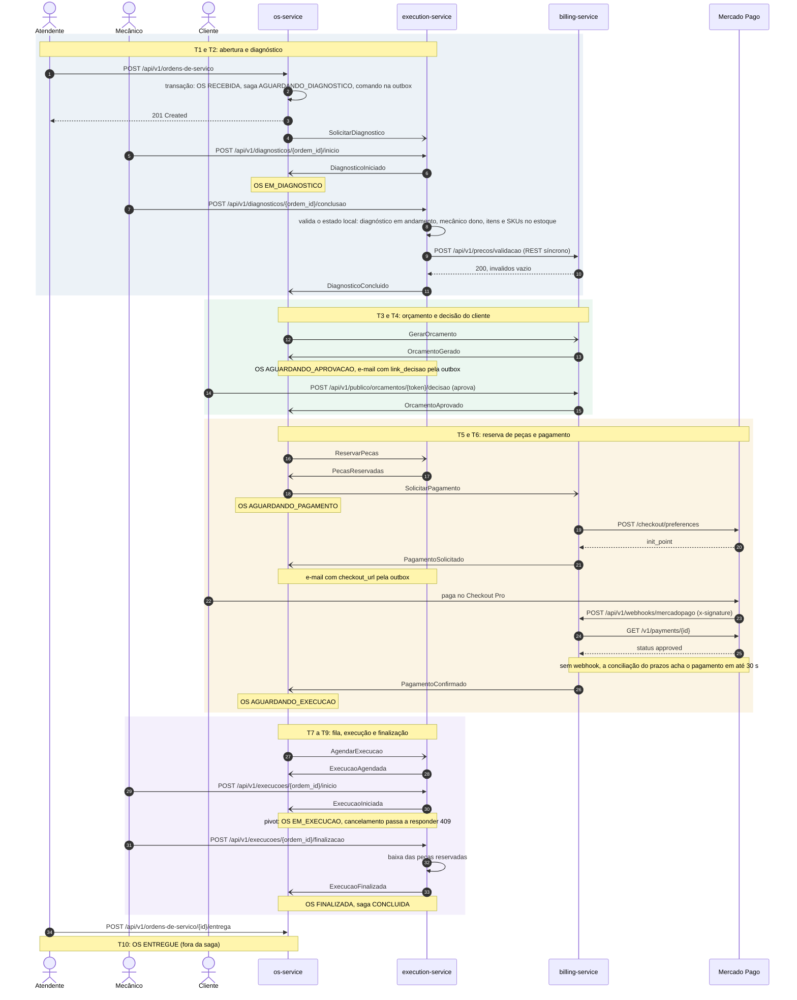

# PytStop fase 4: OS Service

Serviço de ordens de serviço: abertura, status e histórico da OS, cadastro de clientes e veículos (com LGPD), usuários internos (emissão de JWT) e orquestração da saga de atendimento. Banco próprio: PostgreSQL 16.

Parte da fase 4 do Tech Challenge (FIAP Pós Tech, Software Architecture, 15SOAT): o PytStop, sistema de gestão de oficina mecânica das fases anteriores, refatorado em microsserviços com Saga Pattern, mensageria assíncrona, CI/CD por serviço e deploy automatizado em Kubernetes.

**Status:** em construção. Este README será substituído pela documentação completa do serviço (arquitetura, fluxos, exemplos de API, testes e cobertura, pipelines).

**Proveniência:** recorte da `main` do PytStop fase 3 (`postech-sw-arch-p3` @ [`08dcffe`](https://github.com/fiap-postech-sw-architecture/postech-sw-arch-p3/commit/08dcffe6365ece594f438cdbc4c5eef1d88ebfb1) + [`fc06263`](https://github.com/fiap-postech-sw-architecture/postech-sw-arch-p3/commit/fc06263d1f99747145e5a354b817905c59637ebd), a normalização ASCII de CPF/CNPJ do p3 #32), só com os contextos deste serviço (`compartilhado`, `cliente_veiculo`, `autenticacao`, `ordem_servico`). Referências `p3 #N` no código apontam para issues e PRs daquele repositório; IDs como `RF-018`, `ADR-020` e `TD-017` são da numeração contínua das fases anteriores ([requisitos](https://github.com/fiap-postech-sw-architecture/postech-sw-arch-p3/tree/main/docs/requisitos), [ADRs](https://github.com/fiap-postech-sw-architecture/postech-sw-arch-p3/tree/main/docs/arquitetura/adr) e [dívida técnica](https://github.com/fiap-postech-sw-architecture/postech-sw-arch-p3/tree/main/docs/tech-debt) do p3); a fase 4 começa em RF-028 e ADR-034.

**Arquitetura da fase 4:** a RFC-004 e os ADR-034 a ADR-043, citados nos comentários do código como `RFC-004 secao N` e `ADR-0NN`, ficam em [`docs/arquitetura` do platform](https://github.com/fiap-postech-sw-architecture/postech-sw-arch-p4-platform/tree/main/docs/arquitetura).

## O que já existe

- OS da fase 4: `RECEBIDA → EM_DIAGNOSTICO → AGUARDANDO_APROVACAO → AGUARDANDO_PAGAMENTO → AGUARDANDO_EXECUCAO → EM_EXECUCAO → FINALIZADA → ENTREGUE`, com `CANCELADA` antes do início da execução. A OS guarda o histórico de mudanças de status, o resumo do orçamento e do pagamento (que vivem no Billing) e uma versão para lock otimista (escrita concorrente responde 409).
- Saga de atendimento orquestrada pelo OS Service: a abertura da OS inicia a saga, e o consumidor conduz o caminho feliz até `FINALIZADA`, com a etapa visível na OS e na rota de operação ([seção abaixo](#saga)).
- API: `POST/GET /api/v1/ordens-de-servico`, `GET /{id}` (com a etapa da saga), `GET /{id}/historico` (com os passos da saga), `POST /{id}/cancelamento`, `POST /{id}/entrega`, `GET /api/v1/sagas/{ordem_id}` (admin), clientes e veículos com rotas LGPD, autenticação (`/api/v1/autenticacao/*` e o JWKS em `GET /.well-known/jwks.json`), acompanhamento público (`POST /api/v1/publico/acompanhamento`, placa e documento no corpo), `GET /api/v1/saude` (liveness), `GET /api/v1/saude/pronto` (readiness: 503 se o banco não responder em 2 s) e `GET /metrics` (com `API_METRICS_ENABLED=true`, ligado no compose). Swagger em `/docs`.
- Mensageria com RabbitMQ: outbox transacional no envelope do contrato, relay com confirmação do broker, consumidor idempotente da fila `os.eventos` com retry por atraso e DLQ ([seção abaixo](#mensageria)).
- Ainda não: as compensações (falhas de negócio e respostas de compensação vão para a DLQ com o motivo `sem_tratador_nesta_versao`, para o redrive na versão que as trata, e o cancelamento de OS com a saga em andamento responde 409 até passar pela saga), o processo `prazos`, o e-mail ao cliente e os manifestos Kubernetes, desenhados na RFC-004.

## Autenticação

O OS Service é o único emissor de tokens (ADR-039). `POST /api/v1/autenticacao/login` devolve um access token de 15 min e um refresh de 7 dias; `/refresh` troca o refresh por um par novo (uso único); `/logout` revoga o `jti` (identificador do token) do access do cabeçalho e, se o `refresh_token` vier no corpo, o do refresh também: sem ele, o refresh continua valendo até expirar. A revogação só vale neste serviço: nos outros, o limite é a expiração do access.

- **Assinatura:** JWT (JSON Web Token) assinado com RS256 (RSA com SHA-256), com chave RSA de 2048 bits ou mais. Claims: `iss=pytstop-os-service`, `aud=pytstop`, `sub` (UUID do usuário), `papel` (só no access: `admin`, `atendente` ou `mecanico`), `type` (`access` ou `refresh`), `jti`, `iat` e `exp`, sem e-mail.
- **JWKS (JSON Web Key Set):** `GET /.well-known/jwks.json`, público, com `Cache-Control: public, max-age=600` e limite de 60 chamadas por minuto por IP. Traz só a parte pública de cada chave (`kty`, `use`, `alg`, `kid`, `n`, `e`); o `kid` (identificador da chave, repetido no cabeçalho de cada token) é a impressão digital (*thumbprint*, RFC 7638) da chave pública.

  ```bash
  curl -s localhost:8000/.well-known/jwks.json | jq
  ```

- **Quem valida:** Billing e Execução validam o access token localmente, com o JWKS que leem de `JWKS_URL`, sem chamar o OS a cada requisição. Conferem a assinatura RS256 (algoritmo fixo), `iss`, `aud` e `exp` (com 10 s de tolerância entre relógios), `type=access`, `sub` (UUID) e `papel` (um dos três acima); o cache do JWKS é de cada consumidor (README de [Billing](https://github.com/fiap-postech-sw-architecture/postech-sw-arch-p4-billing-service) e de [Execução](https://github.com/fiap-postech-sw-architecture/postech-sw-arch-p4-execution-service)). O `scripts/validar_token.py` é o modelo dessa conferência, só com o PyJWT, e o `make smoke` o roda com o token do login.
- **Erros:** toda falha de credencial responde 401 `NAO_AUTENTICADO` com a mensagem `Credencial ausente, invalida ou expirada`, a mesma dos três serviços; o motivo (assinatura, `aud`, `iss`, claim ausente, `iat` no futuro, token malformado, expirado, revogado) fica só no log. Um refresh reapresentado depois de usado, ou de revogado no logout, gera também o evento `refresh_reuse_detected`. Papel válido sem permissão responde 403 `ACESSO_NEGADO`.

| Variável | Uso |
|---|---|
| `JWT_PRIVATE_KEY` | chave privada RSA em PEM; no cluster vem de um Secret, no compose e no `.env.example` é uma chave de demonstração |
| `JWT_PREVIOUS_PUBLIC_KEY` | opcional: a chave pública que entra (etapa 1 da rotação) ou que sai (etapa 2), só publicada no JWKS e aceita na validação, nunca usada para assinar |
| `JWT_EXPIRATION_MINUTES`, `JWT_REFRESH_EXPIRATION_MINUTES` | validade do access (15, no máximo 60) e do refresh (10080, no máximo 43200 = 30 dias) |

Fora de `development` e `test`, o boot aborta se a chave estiver ausente, ilegível, não for RSA, tiver menos de 2048 bits ou for a de demonstração (como atual ou anterior), ou se uma validade estiver fora dos limites.

### Rotação da chave

A chave privada não entra no repositório nem na imagem (`*.pem` e `*.key` são ignorados pelo git e pelo Docker); gere as chaves num diretório temporário e leve-as direto para o Secret:

```bash
chaves="$(mktemp -d)"   # fora do repositório; apague depois de atualizar o Secret
openssl genpkey -algorithm RSA -pkeyopt rsa_keygen_bits:2048 -out "$chaves/nova.pem"
openssl pkey -in "$chaves/nova.pem" -pubout     # pública da nova
# A pública da atual sai da chave que está no Secret, gravada no mesmo diretório:
openssl pkey -in "$chaves/atual.pem" -pubout
```

A chave nova só assina depois que todos os pods e consumidores a conhecem; por isso a troca tem etapas. Com mais de uma réplica, um pod antigo recusaria o token de um pod novo que assinasse com uma chave que ele ainda não publica. Chame de K1 a chave atual e de K2 a nova:

| Etapa | `JWT_PRIVATE_KEY` | `JWT_PREVIOUS_PUBLIC_KEY` | Depois |
|---|---|---|---|
| 1. Publicar a nova | K1 | pública da K2 | Espere o rollout e os 10 min do cache dos consumidores; confira com `curl -s localhost:8000/.well-known/jwks.json \| jq '.keys[].kid'` (a primeira chave da lista é a que assina) |
| 2. Trocar | K2 | pública da K1 | Os tokens emitidos com a K1 seguem válidos |
| 3. Aposentar a antiga | K2 | vazio | Só depois de 7 dias, a validade do refresh: a partir daqui os tokens da K1 deixam de valer |
| Emergência (K1 comprometida) | K2 | vazio | Derruba as sessões: o OS recusa a K1 assim que o rollout termina e Billing e Execução, quando renovarem o JWKS (até 10 min; até 1 h com o OS fora do ar). É o único jeito de uma chave vazada deixar de forjar tokens `admin` aceitos pelos três serviços |

## Mensageria

O OS Service orquestra a saga pelo RabbitMQ da plataforma, com AMQP (o protocolo do broker): publica comandos para Billing e Execução e consome os eventos que eles publicam ([ADR-036](https://github.com/fiap-postech-sw-architecture/postech-sw-arch-p4-platform/blob/main/docs/arquitetura/adr/fase4/036-mensageria-rabbitmq.md), [RFC-004](https://github.com/fiap-postech-sw-architecture/postech-sw-arch-p4-platform/blob/main/docs/arquitetura/rfc/fase4/rfc-004-microsservicos-saga.md) seção 5). A entrega é pelo menos uma vez e o consumidor é idempotente: cada efeito acontece uma vez (RN-028).



### Contratos

`contratos/` é cópia de arquivos do platform no SHA gravado em `contratos/ORIGEM` (um commit da `main` de lá): do `contratos/` de lá, o AsyncAPI (`asyncapi.yaml`), um JSON Schema por mensagem e os exemplos; em `contratos/rabbitmq/`, a topologia do broker do `k8s/base/rabbitmq/` (definitions, permissões, configuração e o script que cria os usuários) e o admin de demonstração do `compose/`. O `tests/contratos/test_copia_do_platform.py` baixa o platform nesse SHA uma vez (com novas tentativas) e compara cada arquivo byte a byte; atualizar a cópia é copiar de novo e trocar o `ORIGEM`.

O catálogo sai do próprio `asyncapi.yaml`: quem publica cada tipo (o `userId` da operação de envio), em que exchange e routing key, e o que a fila `os.eventos` recebe. Os eventos internos da OS (abertura e mudança de status) ficam no histórico e não vão para o broker.

| | Mensagens |
|---|---|
| O OS publica (11 comandos, enum `Comando`) | `SolicitarDiagnostico`, `DescartarDiagnostico`, `GerarOrcamento`, `CancelarOrcamento`, `ReservarPecas`, `LiberarReserva`, `SolicitarPagamento`, `EstornarPagamento`, `AgendarExecucao`, `CancelarExecucao`, `AnonimizarVeiculo` |
| O OS consome do Billing (13) | `OrcamentoGerado`, `GeracaoDeOrcamentoFalhou`, `OrcamentoAprovado`, `OrcamentoRecusado`, `OrcamentoExpirado`, `OrcamentoCancelado`, `PagamentoSolicitado`, `PagamentoConfirmado`, `PagamentoRecusado`, `PagamentoExpirado`, `PagamentoCancelado`, `PagamentoEstornado`, `EstornoDePagamentoFalhou` |
| O OS consome da Execução (10) | `DiagnosticoIniciado`, `DiagnosticoConcluido`, `DiagnosticoDescartado`, `PecasReservadas`, `ReservaDePecasFalhou`, `ReservaLiberada`, `ExecucaoAgendada`, `ExecucaoCancelada`, `ExecucaoIniciada`, `ExecucaoFinalizada` |

A validação usa o payload de cada mensagem no AsyncAPI: envelope, `tipo`, `versao` e `origem` constantes e o schema de `dados`. O leitor é tolerante (campo novo não invalida) e `versao` desconhecida reprova. O erro aponta o caminho e a regra (`const em $.versao`), nunca o valor, que pode ser a placa ou texto livre.

### Publicar um comando

Na API (e em todo processo sem mensagem de entrada), o caso de uso grava o comando na outbox pela própria unidade de trabalho, no mesmo commit do efeito. O trecho roda com o banco do compose (`set -a && . ./.env && set +a` antes):

```python
from uuid import uuid4

from src.compartilhado.aplicacao.mensageria import Comando
from src.compartilhado.infraestrutura.database import (
    criar_engine,
    criar_session_factory,
    resolver_database_url,
)
from src.compartilhado.infraestrutura.unit_of_work import SQLAlchemyUnitOfWork

ordem_id = uuid4()
uow = SQLAlchemyUnitOfWork(criar_session_factory(criar_engine(resolver_database_url())))
with uow:
    uow.publicar_comando(
        Comando.DESCARTAR_DIAGNOSTICO,
        {"ordem_id": ordem_id, "motivo": "cancelamento"},
        correlation_id=ordem_id,  # o id da OS, que tambem identifica a saga
    )
    uow.commit()
```

No consumidor, o handler recebe a mensagem e a `TransacaoDaMensagem`: monta os repositórios sobre a `session` dela, grava o efeito e publica os comandos nela, sem comitar. O consumidor comita uma vez efeito, comandos e o registro em `mensagens_processadas`; commit, rollback ou close pela `session` dentro do handler, ou um retorno que não é `Desfecho`, mandam a mensagem para a DLQ (fila de mensagens mortas) sem gravar nada. A guarda não alcança o que passa por baixo da `session`, que grava o efeito antes do consumidor: o `commit()` da transação raiz com um savepoint aberto manda a mensagem para a DLQ (o redrive vira `duplicada`), o `session.connection().commit()` faz o commit do consumidor falhar e a mensagem volta pela retry como `duplicada` (o que o handler gravasse depois se perde), e o `COMMIT` em SQL literal (`session.execute(text("COMMIT"))`) passa sem guarda nenhuma. Por isso o handler usa só a `session` e os repositórios:

```python
def tratar_diagnostico_concluido(
    mensagem: MensagemRecebida, transacao: TransacaoDaMensagem
) -> Desfecho:
    ordens = OrdemDeServicoSQLAlchemyRepository(session=transacao.session)
    if ordens.obter_por_id(mensagem.correlation_id) is None:
        return Desfecho.IGNORADA
    transacao.publicar_comando(
        Comando.GERAR_ORCAMENTO,
        {"ordem_id": mensagem.correlation_id, "itens": mensagem.dados["itens"]},
        correlation_id=mensagem.correlation_id,
        causation_id=mensagem.id,
    )
    return Desfecho.PROCESSADA
```

O envelope (`id`, `tipo`, `versao`, `origem=os-service`, `correlation_id`, `causation_id`, `ocorrido_em` em UTC e `dados`) é validado na hora: comando fora do contrato é bug e sobe como 500. A linha guarda o envelope, o exchange, a routing key e o contexto W3C (`traceparent`, `tracestate`) do span corrente; os tempos dela são do relógio do banco.

### Relay (`python -m src.relay`)

- Acorda com o `NOTIFY` da outbox e, por segurança, a cada `OUTBOX_POLL_SEGUNDOS`. Reivindica lotes com `FOR UPDATE SKIP LOCKED` e um lease, na ordem de cada OS: uma linha em espera segura as seguintes da mesma OS, e `dead` não segura.
- Nenhuma transação fica aberta durante a publicação: claim, renovação do lease antes de publicar e desfecho são transações curtas, e o fim do lease gravado no claim é o token da réplica. Quem perdeu a linha (o lease venceu e outra réplica a reivindicou) não grava o desfecho por cima. A entrega é pelo menos uma vez: um publish que passa do lease pode sair também pela outra réplica, e o consumidor do destino descarta a repetição pelo `id`.
- Publica com *publisher confirms* e `mandatory`, com as propriedades AMQP do contrato (`message_id`, `correlation_id`, `type`, `user_id=os`, `content_type`, `delivery_mode=2`) e o `traceparent` no header. A linha só vira `entregue` depois da confirmação.
- Mensagem devolvida (sem fila para a routing key), recusada (nack), canal fechado pelo broker ou qualquer outra falha da própria linha conta tentativa e volta depois de 1, 4, 16 e 64 s; na quinta falha vira `dead` (métrica `outbox_dead`). Envelope fora do contrato vira `dead` direto.
- Broker fora do ar não conta tentativa: sem conexão o relay não reivindica linhas e reconecta com backoff (espera sorteada entre 0 e um teto que dobra de 1 s até 30 s), e as linhas de um lote interrompido voltam na hora. Com o broker em alarme de memória ou disco, a conexão bloqueada para os claims até o desbloqueio, e o timeout do bloqueio (30 s) derruba a conexão como uma queda.
- Uma vez por hora apaga, em lotes de 1000, as linhas entregues há mais de 7 dias e as `dead` há mais de 30, contados da morte da linha e não da criação (a janela para o redrive); `pendente` nunca expira.

### Consumidor (`python -m src.consumidor`)

Para cada mensagem da fila `os.eventos`, uma por vez (prefetch 1) e com ack manual:

1. Origem: o `user_id` (o broker garante que é o usuário da conexão de quem publicou) tem de ser o produtor do `tipo` no catálogo; a cópia que volta da fila de retry traz o `user_id` do próprio consumidor e só é aceita com `x-tentativa` de 1 a 5. Sem `user_id`, ou qualquer outro caso, vai para a DLQ.
2. Trace: o span CONSUMER é filho do `traceparent` recebido.
3. Contrato: corpo de até 64 KiB, JSON, envelope e `dados` validados; `message_id`, `correlation_id` e `type` têm de bater com o envelope. Antes da validação, só o `message_id` e o `correlation_id` convertidos em UUID vão para o log e o span.
4. Efeito: grava o `id` em `mensagens_processadas` e chama o handler do `tipo` no despachante (`montar_despachante`, em `src/consumidor.py`: os 23 eventos vão ao orquestrador da saga) com a transação da mensagem; o consumidor comita e só então dá ack. Id repetido recebe ack sem efeito.

| Situação | Resultado |
|---|---|
| Handler concluiu | ack (`processada`, ou `ignorada` quando a mensagem não corresponde ao estado atual) |
| Mesmo `id` de novo | ack sem efeito (`duplicada`) |
| Erro transitório (banco fora, `FalhaTransitoriaError`, conflito de versão) | cópia em `pytstop.retry` com `x-tentativa` + 1 e a routing key da fila do nível (`os.eventos.retry.1s`, `.5s`, `.15s`, `.60s` e `.300s`), com confirmação e `mandatory`, e só então o ack (`retry`); a cópia leva as propriedades da original e o contexto de trace do consumo |
| Sexta falha transitória, tipo, versão, contrato ou origem inválidos, cópia de retry devolvida ou recusada, `FalhaPermanenteError` do handler (com o motivo dela em código no log) ou outra exceção do handler | `reject` sem requeue, e a fila manda para `os.eventos.dlq` (`dlq`); o `id` não entra em `mensagens_processadas`, e o redrive trata a mensagem de novo |

Cada nível de atraso tem a sua fila, com o TTL (tempo de vida da mensagem) como argumento dela: uma fila só, com `expiration` por mensagem, seguraria a cópia de 1 s atrás da de 300 s, porque a mensagem só expira na cabeça da fila. Uma mensagem que o cliente AMQP não consegue nem decodificar (um header de timestamp fora do intervalo, por exemplo) derruba a conexão a cada entrega: com prefetch 1 só ela cai, e o `delivery-limit` de 5 da fila (policy do platform) a manda para a DLQ sem levar as seguintes. Uma vez por hora o consumidor apaga, em lotes, as linhas de `mensagens_processadas` com mais de 30 dias.

### Observabilidade, saúde e encerramento

- Spans: `publish <tipo>` (PRODUCER, filho do span que gravou a outbox) e `process <tipo>` (CONSUMER, filho da publicação), com `correlation_id` como atributo e o status de erro só com o tipo da exceção; os laços ociosos não abrem span. O SDK do OpenTelemetry fica sempre ligado no relay e no consumidor, e `OTEL_ENABLED=true` liga a exportação OTLP (o protocolo do OpenTelemetry) para o Jaeger. O recurso leva `service.name` (de `OTEL_SERVICE_NAME`) e `pytstop.processo` (`api`, `relay` ou `consumidor`).
- Logs JSON com `correlation_id`, `trace_id` e `span_id`, sem dados pessoais nem texto livre: o envelope não vai para o log, e do cliente AMQP só sai o nível ERROR (em WARNING ele imprime o corpo da mensagem devolvida).
- Métricas no `/metrics` de cada processo (porta `METRICS_PORT`, 9100): `pytstop_mensagens_publicadas_total{tipo}`, `pytstop_mensagens_consumidas_total{tipo,resultado}`, `pytstop_reconexoes_ao_broker_total{processo}` (para o alerta de processo preso reconectando), `outbox_pendentes` e `outbox_dead`.
- Saúde: cada processo toca `/tmp/<processo>-heartbeat` a cada volta do laço, a cada linha do lote do relay e entre os lotes da limpeza (liveness), e mantém `/tmp/<processo>-pronto` enquanto está conectado ao broker (readiness). Broker fora, inclusive com o nome dele sem resolução no DNS (o Service headless sem pod pronto), tira o processo de pronto sem reiniciá-lo, e ele reconecta com backoff. A sonda de liveness tolera 90 s sem heartbeat: com o broker mudo um publish fica até cerca de 70 s preso antes de o heartbeat AMQP (30 s) derrubar a conexão, e com o broker em alarme até 30 s. No SIGTERM o processo termina a mensagem em curso e fecha as conexões; no consumidor, as demais seguem na fila.
- Banco: relay e consumidor usam um pool de 2 + 2 conexões e sessões com `statement_timeout` de 15 s e `lock_timeout` de 10 s, abaixo da janela do heartbeat do broker (o handler roda na thread da conexão AMQP).

### Configuração

| Variável | Padrão | Uso |
|---|---|---|
| `RABBITMQ_URL` | obrigatória | URL AMQP com o usuário `os`; fora de `development` e `test`, a senha de demonstração é recusada no boot (a do Postgres também) |
| `METRICS_PORT` | 9100 | porta do `/metrics` do relay e do consumidor |
| `OUTBOX_POLL_SEGUNDOS` | 5 | poll de segurança do relay, de 0,1 a 15 s (o laço ocioso atende o heartbeat AMQP) |
| `OUTBOX_LOTE` | 10 | linhas por lote do relay (1 ou mais) |
| `OUTBOX_LEASE_SEGUNDOS` | 60 | lease de cada linha reivindicada (45 ou mais: cobre o publish bloqueado por alarme do broker, de até 30 s, e a marcação da linha) |
| `OTEL_ENABLED`, `OTEL_EXPORTER_OTLP_ENDPOINT` | `false`, `http://jaeger:4317` | exportação OTLP dos spans |
| `OTEL_SERVICE_NAME` | `pytstop-os-service` | `service.name` dos spans |
| `SAGA_PRAZO_RESPOSTA_SEGUNDOS` | 120 | prazo técnico gravado pela saga no envio de cada comando com resposta automática (1 ou mais; [seção Saga](#saga)) |

Valor fora da faixa aborta o boot com a variável e o valor na mensagem.

## Saga

O OS Service orquestra a saga de atendimento ([ADR-035](https://github.com/fiap-postech-sw-architecture/postech-sw-arch-p4-platform/blob/main/docs/arquitetura/adr/fase4/035-saga-orquestrada.md), [RFC-004](https://github.com/fiap-postech-sw-architecture/postech-sw-arch-p4-platform/blob/main/docs/arquitetura/rfc/fase4/rfc-004-microsservicos-saga.md) seção 4): uma instância por OS, com `saga_id = ordem_id`, que também é o `correlation_id` de todas as mensagens. A saga é um *process manager* da camada de aplicação (`src/ordem_servico/aplicacao/saga/`), com estado e regras sem I/O, persistido como agregado próprio na tabela `sagas`, no mesmo PostgreSQL da outbox. A etapa da saga, o status da OS, o passo e o comando seguinte entram no mesmo commit: na abertura, o da requisição; nos eventos, o do consumidor, junto com `mensagens_processadas`.

### Por que orquestração

São nove passos (T1 a T9) em três serviços, mais a entrega local (T10), com esperas humanas (mecânico e cliente), um provedor externo (Mercado Pago) e seis compensações. A Aula 02 de SAGA Pattern, citando Richardson, recomenda a coreografia para sagas simples, e esta não é: com coreografia, os passos ficariam espalhados nos três serviços, sem um lugar que diga em que etapa a OS está, e prazos, ordem das compensações e o pivot exigiriam que cada serviço assinasse eventos dos outros dois, com risco de ciclo. Com o orquestrador no serviço que abre a OS, como nos exemplos do material (o orquestrador fica no serviço que inicia a saga), o fluxo inteiro fica num lugar só, testável sem broker, e etapa e status mudam na mesma transação local. Os dois contras que a aula aponta ficam contidos: o orquestrador só conhece a ordem dos passos, as compensações e os prazos (preço, validade e pagamento são dos participantes, que respondem a comandos sem conhecer a saga), e não é ponto único de falha, porque o estado fica no banco e o consumidor roda em réplicas. As alternativas descartadas (coreografia, orquestrador como quarto serviço, motor de workflow) estão no ADR-035.

### Caminho feliz

O diagrama é o da RFC-004, seção 4.8a; setas abertas são mensagens assíncronas (outbox, relay, exchange, fila, consumidor).



O e-mail ao cliente aparece no diagrama da RFC e ainda não sai deste serviço.

### Etapas e status

Etapa (o estado do orquestrador) e status (o que cliente e atendente veem) são campos diferentes, com dois nomes em comum; a API, o banco e o label `etapa` das métricas usam os nomes em minúsculas.

| Etapa | Status da OS | Evento que tira a saga da etapa | Comando enviado |
|---|---|---|---|
| `aguardando_diagnostico` | `recebida`; `em_diagnostico` com `DiagnosticoIniciado` | `DiagnosticoConcluido` (com a OS em diagnóstico) | `GerarOrcamento`, com os itens do diagnóstico |
| `aguardando_orcamento` | `em_diagnostico` | `OrcamentoGerado` (a OS guarda o resumo) | nenhum |
| `aguardando_decisao` | `aguardando_aprovacao` | `OrcamentoAprovado` | `ReservarPecas`, com as peças dos itens (lista vazia vale) |
| `aguardando_reserva` | `aguardando_aprovacao` | `PecasReservadas` | `SolicitarPagamento` |
| `aguardando_pagamento` | `aguardando_pagamento` | `PagamentoConfirmado` (depois do `PagamentoSolicitado`, que grava o resumo) | `AgendarExecucao`, prioridade `normal` |
| `aguardando_agendamento` | `aguardando_execucao` | `ExecucaoAgendada` (a posição na fila fica só no passo) | nenhum |
| `aguardando_inicio` | `aguardando_execucao` | `ExecucaoIniciada` (pivot) | nenhum |
| `em_execucao` | `em_execucao` | `ExecucaoFinalizada` | nenhum |
| `concluida` | `finalizada`; `entregue` com a entrega (T10, fora da saga) | nenhum | nenhum |

A tabela vive no agregado `Saga`: antes de mudar, ele confere que o evento é da OS, que se classifica para ser processado (com os marcos da OS de antes do fato) e que o comando enviado é o da linha, com o `ordem_id` da OS, os itens ou as peças que a saga guarda e o prazo técnico; o orquestrador só traduz cada evento em chamadas (o fato na OS, o comando na outbox e o passo na saga). Cada comando sai com `causation_id` = id do evento que o causou; o `SolicitarDiagnostico` da abertura, causado pela requisição, sai sem ele. O comando com resposta automática (`GerarOrcamento`, `ReservarPecas`, `SolicitarPagamento` até o `PagamentoSolicitado` e `AgendarExecucao`) vira o comando em voo da saga, com o prazo técnico (`prazo_resposta_em`, `SAGA_PRAZO_RESPOSTA_SEGUNDOS` depois do envio) e o id de cada envio (`mensagem_ids`), com que a resposta casa pelo `causation_id`. O `SolicitarDiagnostico` e as esperas humanas não têm prazo. A saga guarda só códigos (etapa, gatilho, comando, ator); texto livre e placa ficam na OS e na mensagem.

### Evento fora de ordem

O consumidor entrega cada evento ao orquestrador, que o classifica pela etapa antes de tocar no domínio (RFC-004 seção 4.5):

| Situação | Exemplo | Desfecho |
|---|---|---|
| Etapa do evento é a atual | `OrcamentoGerado` em `aguardando_orcamento` | processado: status, passo e comando seguinte |
| Etapa já passada, inclusive a resposta republicada | `OrcamentoGerado` em `aguardando_decisao` | ignorado com log (`saga event ignored`) |
| Mesma etapa, fato já aplicado | `DiagnosticoIniciado` com a OS já em diagnóstico; `PagamentoSolicitado` com o resumo gravado | ignorado com log |
| Etapa à frente da atual | `ExecucaoIniciada` antes da `ExecucaoAgendada` | adiantado (`FalhaTransitoriaError`): volta pela fila de retry até a saga alcançá-lo |
| Mesma etapa, antes do fato que o habilita | `DiagnosticoConcluido` com a OS ainda `recebida`; `PagamentoConfirmado` antes do `PagamentoSolicitado` | adiantado |
| Saga concluída ou fora do fluxo normal | `ExecucaoFinalizada` repetida em `concluida` | ignorado com log |
| OS sem saga, ou `ordem_id` dos dados diferente do `correlation_id` | | erro permanente: DLQ com o motivo `saga_inexistente` ou `ordem_id_divergente` |
| OS cancelada ou entregue com a saga viva (estado que o cancelamento recusa) | | DLQ com o motivo `ordem_encerrada`: nenhum comando para OS encerrada |
| Falha de negócio ou resposta de compensação na etapa em que caberia tratá-la | `OrcamentoRecusado` em `aguardando_decisao` | DLQ com o motivo `sem_tratador_nesta_versao` (nesta versão, sem compensações) |
| Fato que a OS ou a saga recusam | | DLQ com o motivo `transicao_invalida` |

Nenhum evento fora de ordem vai para a DLQ: o adiantado espera a saga nas cinco cópias de retry (1 a 300 s), bem mais que o atraso entre eventos do mesmo passo. Falhas de negócio (`GeracaoDeOrcamentoFalhou`, `OrcamentoRecusado`, `OrcamentoExpirado`, `ReservaDePecasFalhou`, `PagamentoRecusado`, `PagamentoExpirado`) e respostas de compensação passam pela mesma classificação; nesta versão, a que chega na etapa em que caberia tratá-la vai para a DLQ, onde o alerta a mostra, em vez de ser consumida sem efeito: o `id` dela não entra em `mensagens_processadas`, e o redrive na versão com as compensações a processa. O motivo de cada recusa sai em código no log `message rejected to dlq` e no status de erro do span do consumo.

### Cancelamento nesta versão

O `POST /api/v1/ordens-de-servico/{id}/cancelamento` de OS com a saga em andamento responde 409 (`TRANSICAO_STATUS_INVALIDA`, "Cancelamento de OS com atendimento em andamento ainda nao disponivel") sem mudar a OS: o cancelamento passa pela saga, que dispara as compensações (RFC-004 seção 4.4), e esta versão ainda não as tem. Assim a OS nunca fica cancelada com a saga viva, que seguiria emitindo comandos para uma OS encerrada. OS sem saga (anterior a ela) é cancelada direto, como antes, e a entrega só passa com a OS finalizada, que só chega lá pela saga concluída.

### Consulta e operação

- `GET /api/v1/ordens-de-servico/{id}`: a etapa da saga ao lado do status.
- `GET /api/v1/ordens-de-servico/{id}/historico`: as mudanças de status, com o ator de cada uma (`sub` do JWT ou o processo `consumidor`), e os passos da saga (gatilho, etapa antes e depois, comando enviado e ator).
- `GET /api/v1/sagas/{ordem_id}` (admin): etapa, motivo, falha, plano de compensação restante, comando em voo (tipo e hora do envio), reenvios, prazo e passos; é a primeira consulta do [runbook da saga](https://github.com/fiap-postech-sw-architecture/postech-sw-arch-p4-platform/blob/main/docs/operacao/runbook-saga.md).

```bash
curl -s localhost:8000/api/v1/sagas/$ORDEM_ID -H "Authorization: Bearer $TOKEN" | jq
```

### Observabilidade da saga

- Trace: o span da requisição de abertura é a raiz do trace da saga; a outbox guarda o contexto, o relay publica como filho, e o `process <tipo>` do consumidor ganha `pytstop.saga.etapa`, `pytstop.saga.etapa_nova` e `pytstop.saga.desfecho` (`processada`, `ignorada`, `adiantada` ou `recusada`, com o motivo no status de erro). A saga guarda o `traceparent` da última transição.
- Métricas ([ADR-043](https://github.com/fiap-postech-sw-architecture/postech-sw-arch-p4-platform/blob/main/docs/arquitetura/adr/fase4/043-observabilidade-distribuida.md)): `pytstop_saga_iniciadas_total` (API), `pytstop_saga_finalizadas_total{resultado}` e `pytstop_saga_etapa_duracao_segundos{etapa}` (quem tira a saga da etapa), contadas só depois do commit (rollback e conflito de versão não contam, e a retry não conta duas vezes); `pytstop_saga_ativas{etapa}` e `pytstop_saga_etapa_mais_antiga_segundos{etapa}`, gauges que o coletor da API calcula numa consulta por raspagem. As séries de rótulo fechado nascem em zero em cada processo.
- Logs JSON em inglês com `correlation_id`, `etapa` e `tipo`: `saga started`, `saga transition`, `saga event ignored` (com a classificação) e `saga event ahead`, sem texto livre, placa nem links.

### Testes da saga

- Unitários: cada linha da tabela de etapas (status, comando e `dados`, prazo) e a matriz etapa x tipo (12 x 23), gerada da tabela da RFC e conferida pelo handler (`tests/unitarios/ordem_servico/test_saga.py` e `test_orquestrador.py`).
- Propriedade: em mil sementes, participantes simulados respondem a cada comando com eventos embaralhados, repetidos com id novo e atrasados, com retry nos atrasos das filas; só a falha transitória escapa, o par etapa e status fica na tabela, o repetido não muda nada e nada vai para a DLQ (`test_propriedades_da_saga.py`).
- BDD de componente: `tests/bdd/saga_atendimento.feature`, em português, com o OS sobre o PostgreSQL de teste e um barramento em memória no lugar do RabbitMQ.
- Integração: relay, consumidor e RabbitMQ reais com participantes falsos, do caminho feliz até `ENTREGUE` num trace só, o adiantado passando pela retry, as recusas na DLQ com o motivo e a transação única: com o `PagamentoConfirmado`, o commit recusado depois de gravadas a OS, o histórico, a saga e o comando desfaz tudo, inclusive o registro da mensagem (`tests/integracao/mensageria/test_saga_com_broker.py`).

## Como rodar local

Pré-requisitos: Docker com Compose e [uv](https://docs.astral.sh/uv/).

```bash
make compose-up      # build da imagem, PostgreSQL 16, RabbitMQ, migrações, admin de demonstração, relay e consumidor
curl -s localhost:8000/api/v1/saude
make compose-down    # derruba e apaga os volumes
```

A API sobe em `http://localhost:8000` (porta configurável com `APP_PORT`) e o Swagger em `http://localhost:8000/docs`. O RabbitMQ do compose carrega a topologia de `contratos/rabbitmq/` e cria os usuários dos três serviços; o console fica em `http://localhost:15674` (usuário `admin`, senha de demonstração em `contratos/rabbitmq/rabbitmq-admin.json`) e o AMQP em `localhost:5674`, fora das portas do compose do platform. O usuário de demonstração é `admin@pytstop.dev` com a senha de `ADMIN_PASSWORD` no `docker-compose.yml` (valores só de dev; o boot com `ENVIRONMENT=production` recusa esses literais).

```bash
TOKEN=$(curl -s localhost:8000/api/v1/autenticacao/login \
  -H 'Content-Type: application/json' \
  -d '{"email":"admin@pytstop.dev","senha":"admin-demo-os-2026"}' | jq -r .access_token)
curl -s localhost:8000/api/v1/ordens-de-servico -H "Authorization: Bearer $TOKEN"
```

Fora do compose (API, relay e consumidor no host), o `.env.example` lista todas as variáveis lidas pelo serviço, com os mesmos valores de demonstração; o RabbitMQ pode ser o do compose (`docker compose up -d rabbitmq rabbitmq-usuarios`, AMQP em `localhost:5674`):

```bash
docker run -d --name os-postgres -p 127.0.0.1:5432:5432 \
  -e POSTGRES_DB=os -e POSTGRES_USER=pytstop -e POSTGRES_PASSWORD=pytstop postgres:16
cp .env.example .env && set -a && . ./.env && set +a
uv run alembic upgrade head && uv run python scripts/seed_admin.py
uv run python -m src.main         # API em http://127.0.0.1:8000
uv run python -m src.relay        # outro terminal, com o mesmo .env
uv run python -m src.consumidor   # outro terminal (METRICS_PORT diferente do relay)
```

## Qualidade

```bash
make check   # uv.lock em dia, ruff (lint e formato), import-linter, mypy strict, bandit e pytest
make audit   # pip-audit das dependências de runtime (com os extras da imagem)
make smoke   # imagem pelo entrypoint real: readiness, login do admin semeado validado pelo JWKS
             # (e a assinatura adulterada recusada), log de boot em JSON, a imagem de produção
             # (usuário 1001, ENVIRONMENT=production, sem header server), relay e consumidor
             # prontos (/metrics respondendo, outbox_pendentes numerico, consumidor inscrito
             # em os.eventos com prefetch 1 no list_consumers), depois down -v
```

`make test` (ou `uv run pytest`) roda os testes unitários, os de contrato, o BDD de componente da saga e os de integração contra um PostgreSQL e um RabbitMQ 4.3.6 efêmeros (testcontainers, Docker necessário), com gate de cobertura de 90% (`.coveragerc`). O teste de checksum dos contratos baixa o platform do GitHub e precisa de rede: offline, rode com `-m "not rede"` (a cobertura do gate continua valendo). O schema dos testes de integração é criado pela própria migração Alembic, e o broker de teste sobe com a topologia de `contratos/rabbitmq/`, só com o TTL das filas de retry reduzido a 100 ms para o ciclo inteiro de tentativas caber num teste.

No GitHub, o workflow `CI` (`.github/workflows/ci.yml`) roda os mesmos gates em todo PR, publica `coverage.xml`, `htmlcov/` e o JUnit como artefato com o resumo de cobertura por pacote no summary, passa o SonarQube com quality gate versionado (`.sonar/quality-gate.json`), builda a imagem e roda o `make smoke`. O workflow `Security` roda pip-audit (dependências de runtime com os extras da imagem), gitleaks e trivy (imagem), em todo PR e toda segunda-feira.

## Repositórios da fase 4

| Repositório | Papel |
|---|---|
| [postech-sw-arch-p4-os-service](https://github.com/fiap-postech-sw-architecture/postech-sw-arch-p4-os-service) | Ordens de serviço, clientes e veículos, usuários internos e orquestrador da saga |
| [postech-sw-arch-p4-billing-service](https://github.com/fiap-postech-sw-architecture/postech-sw-arch-p4-billing-service) | Orçamentos, pagamentos via Mercado Pago e tabela de preços |
| [postech-sw-arch-p4-execution-service](https://github.com/fiap-postech-sw-architecture/postech-sw-arch-p4-execution-service) | Fila de diagnóstico e execução e estoque de peças |
| [postech-sw-arch-p4-platform](https://github.com/fiap-postech-sw-architecture/postech-sw-arch-p4-platform) | Infraestrutura compartilhada, testes E2E, arquitetura global e entrega |

A `main` é protegida desde o primeiro commit: toda mudança entra por pull request com squash.
